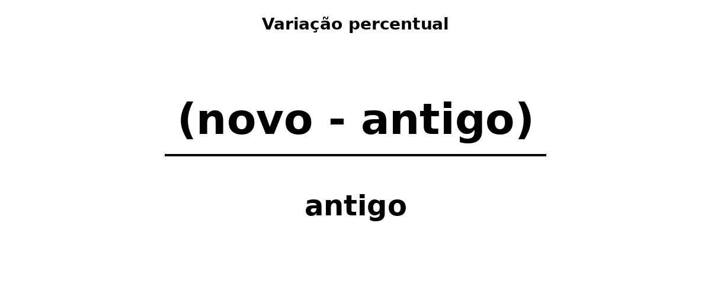

# Encontro II - 2026/08/12

Estatistica

- coleta
- organização
- interpretação

Melhorar a qualidade da informação.

Melhor decisão.

## Exercicios Revisão

1. Faça o arredondamento de:

a. 12,487 para duas casas decimais

b. 7,995 para duas casas decimais

c. 145,3248 para uma casa decimal

2. Calcule 18% de R$ 750,00

3. Um produto custa R$ 2.800,00 e recebeu desconto de 15%. Qual é o novo preço?

4. Um salário passou de R$ 3.500,00 para R4 3.920,00. Qual foi o aumento percentual?

## 

"Na estatistica, é muito dificil falar o que é grande e o que é pequeno", disse o professor.

O prefessor estudou em Botucatu.

"A IA conseguiu antecipar, entre 5 e 7 anos, um diagnostico mamografico", disse o professor.

"Lembra da informação [não do dado]"

##

"(novo - antigo) / antigo"

## Elementos Estatísticos

- População - conjunto de elementos com uma caracteristica

- Amostra (representativa) - subconjunto da população (parte)

##

"As vezes, não temos tempo, dinheiro ou infraestrutura para fazer"

## 

- Descritiva

- Inferencial

"A partir de uma amostra, eu vou inferir para a população inteira."

## 

Enviesar: utilizado em contextos de estatística, jornalismo e ciências sociais para descrever a manipulação ou viés inconsciente de dados e interpretações.

## 

- O que é ser exato?

- O que é ser preciso?

## 

De "y = ax + b" para "y = ax + b + ɛ", onde ɛ é a margem de erro.

## Exercicios

1. De exemplos de população e amostra no contexto do curso de IA.

2. Pesquise sobre a diferença (e definição) de precisão e exatidão.

3. Pesquise sobre representatividade da amostra.
