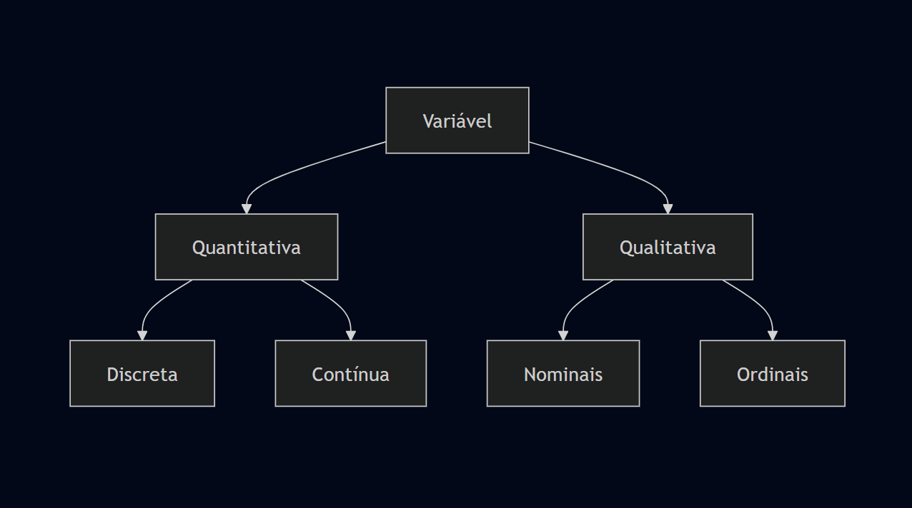

# Encontro III - 2026/08/19 - Estatistica

## Amostra Casual Simples

A amostragem casual simples é um método de amostragem probabilística onde cada elemento da população tem a mesma probabilidade de ser selecionado para compor a amostra. 

### Características:

- Equiprobabilidade: Todos os itens têm a mesma chance de escolha.
- Independência: A seleção de um item não influencia a seleção de outro.
- Aplicação: Ideal para populações homogêneas e de tamanho conhecido.

### Processo de Seleção:

1. Listagem de todos os elementos da população (frame amostral).
2. Atribuição de um número único a cada elemento.
3. Sorteio aleatório dos números utilizando tabelas de números aleatórios ou softwares.

## Amostra estratificada proporcional

A amostragem estratificada proporcional é um método onde a população é dividida em subgrupos (estratos) com características semelhantes, e a amostra de cada estrato é proporcional ao tamanho desse estrato na população total.

### Características:

- Representatividade: Garante que subgrupos importantes estejam representados na amostra.
- Precisão: Reduz o erro amostral ao diminuir a variabilidade dentro de cada estrato.
- Proporcionalidade: O tamanho da amostra de cada estrato mantém a mesma proporção da população.

### Processo de Seleção:

1. Divisão da população em estratos mutuamente exclusivos.
2. Cálculo da proporção de cada estrato em relação ao total.
3. Aplicação dessa proporção ao tamanho total da amostra desejada.
4. Sorteio de uma amostra casual simples dentro de cada estrato.

## Exemplo

P: Uma base de dados de clientes de um e-commerce tem 1000 clientes cadastrados, sendo 70% de usuários Android e 30% de iOS. É necessário retirar uma amostra de 100 clientes dessa base. Esquematize a amostragem.

R: ...

## Exercícios

1. Para um projeto de IA, é necessário extrair uma amostra de 200 usuários de um banco de dados de um aplicativo de entregas para testar um sistema de recomendação. A população total é de 200 usuários, divididos em 3 categoria: Bronze (1200), Silver (600), Gold (200). Calcule quantos clientes de cada categoria devem constar na sua amostra.

2. Você está desenvolvendo um sistema para recomendar alunos para vagas de monitoria na Fatec. A população elegível é de 3 períodos: matutino (100), vespertino (30), noturno (60). Esquematize uma amostragem estratificada proporcional de 25 alunos.

## 

Para arrendondar, a casa decimal é:

- Maior ou igual a 5? Sobe.
- Menor que 5? Mantem.

## Variável

é uma caracteristica de uma população ou amostra que pode ser medida ou categorizada.

- quantitativa: numeros
- discreta: contagem
- continua: real
- qualitativa: palavra/nome
- nominais: classificação/categorização
- ordinais: sequencia/nivel

## Exercícios

1. Classifique as variaveis

a. id do funcionário
b. cargo
c. quantidade de projetos concluidos
d. RA do aluno
e. nota final de uma linha
f. tempo de resposta do servidor (em milissegundos)
