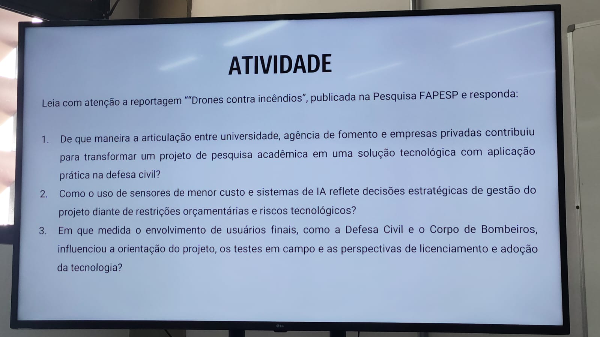

# Encontro I - 2026/08/07

## Fatores Criticos de Sucesso

- Tamanho da Organização
- Tamanho do Projeto
- Tipo de Organização
- Experiência de Trabalho do Gerente de Projetos

##

- Ambiente
- Macro x micro
- Fortalezas e fraquezas
- Oportunidades e ameaças

## Atividade

